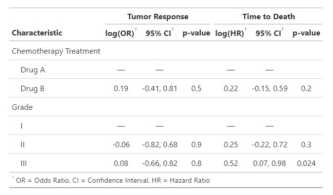
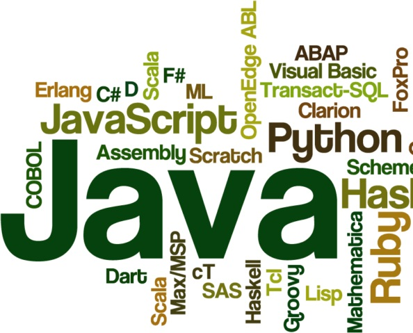

<h1 align="center">👋 Hello! Je suis votre Spécialiste en Analyse de Données</h1>

  

<h2 align="center"> <b>✨ Pourquoi collaborer avec moi ? </b></h2>

  

<b>Gagnez du temps et des ressources :</b> En faisant les choses bien dès le départ.

<b>Obtenez des résultats plus fiables et valides :</b> Permettant des conclusions plus solides.

<b>Augmentez l’impact de vos travaux :</b> En contribuant de manière significative aux connaissances médicales.

<b>Assurez une conduite éthique :</b> En minimisant les erreurs et les interprétations erronées.

---

<h3 align="center">✔️Posez les bonnes questions, ✔️collectez les bonnes données et ✔️tirez les bonnes conclusions</h3>

  

  
💡<b>Concevez</b> votre étude pour obtenir des réponses pertinentes.

  
  
🧐<b>Analysez</b> vos données, même si les mathématiques ne sont pas votre point fort.

  
  
💪<b>Renforcez</b> votre thèse, vos publications et vos présentations.

  
  
🚀<b>Optimisez</b> votre conception d’étude pour un impact et une efficacité maximum.

  
  
🔍<b>Explorez</b> des insights plus profonds grâce à des techniques analytiques avancées.

  
   
🌟<b>Élevez</b> la rigueur scientifique et le potentiel de publication de vos recherches.

     

---

<h3 align="center">Compréhension rapide des spécificités uniques de chaque projet</h3>

  Mon approche est proactive et axée sur des travaux clairs et percutants, avec une priorité sur la rapidité et l'atteinte des objectifs. 
  Pour une collaboration fluide, je propose des explications didactiques qui renforcent vos compétences et augmentent ainsi votre autonomie.

  

---

 <b>🎯 Principales forces</b> 

  
<b>Analyse quantitative & modélisation prédictive :</b> Exploitation de modèles statistiques avancés pour des insights robustes

  
<b>Consultation méthodologique :</b> Accompagnement des chercheurs et étudiants en médecine dans leurs projets.

  
<b>Science des données & IA :</b> J’explore comment la science des données et l'IA résolvent des problèmes concrets.

  
<b>💬 Conception de protocoles & Communication scientifique, 📊 Gestion des données & Statistiques avancées</b>

  
<b></li>

  
<b>💻 Programmation (R, Shiny, Python, SQL) & 👁️‍🗨️ Visualisation des données</b>

  

<h2 align="center">Prenez des décisions stratégiques basées sur les données 🚀</h2>

  
  

<b>Expertise hautement transférable et adaptable à tout domaine professionnel</b>

<b>Transparence, méthodologies rigoureuses, documentations</b>

<b>Maitrise rapide des logiciels de business intelligence</b>

<b>Développement de fonctions personnalisées avec R pour des solutions sur mesure.</b>

<b>Contrôle strict de la qualité des données à chaque étape du processus.</b>

  <a href="https://github.com/MedDataMuse?tab=repositories">
    <b>👇🏽 Découvrez mes travaux ⬇️</b>
  </a>

