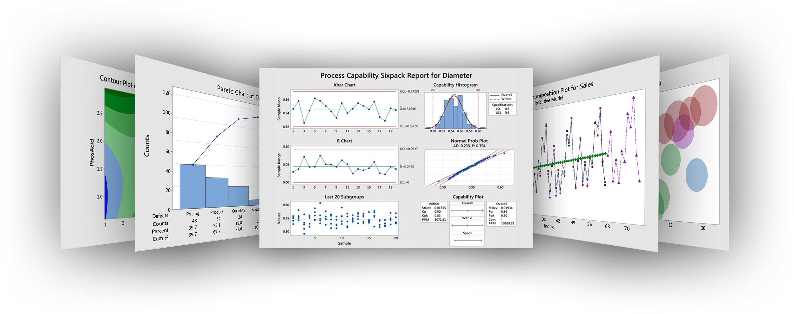
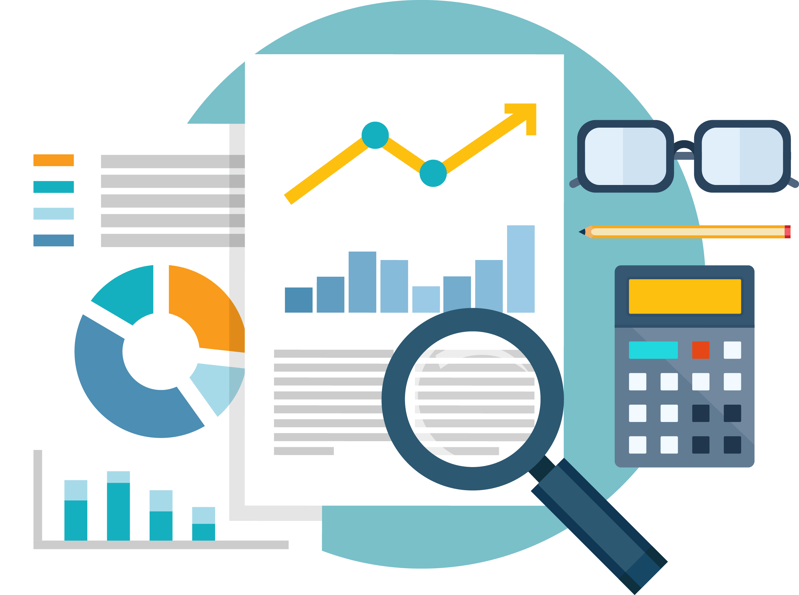
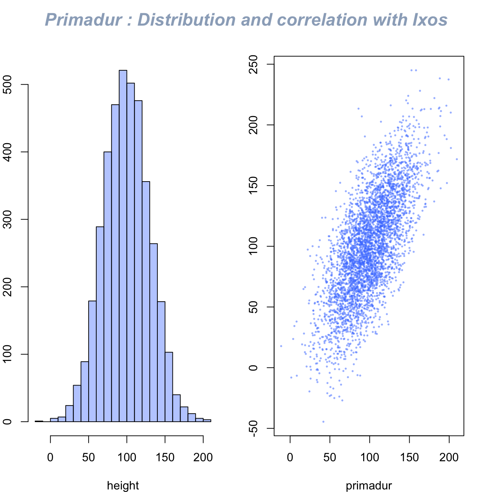
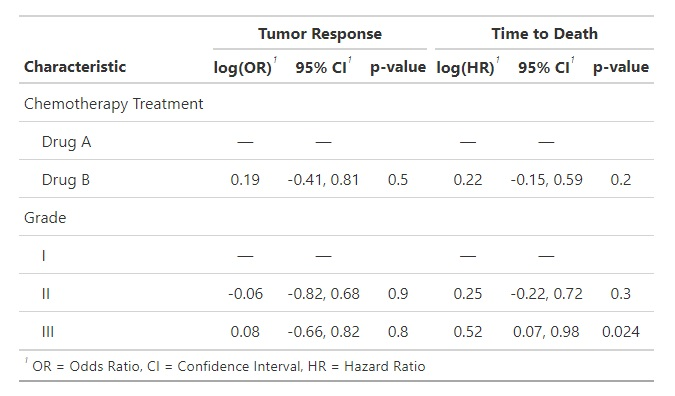
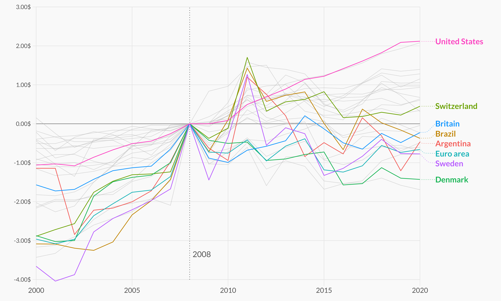
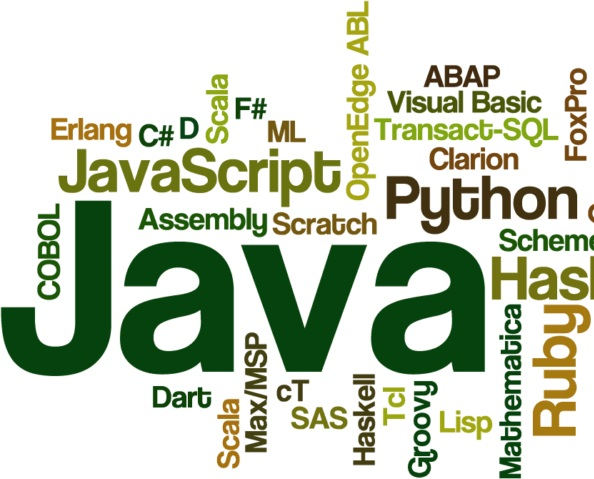

---

<h1 align="center">👋 Hello! I am your Data Analysis Specialist</h1>

  

---

<b>✨ Why collaborate with me?</b>

  

<b>Save time and resources:</b> By doing things right from the start.

<b>Get more reliable and valid results:</b> Allowing for stronger conclusions.

<b>Increase the impact of your work:</b> By making a significant contribution to medical knowledge.

<b>Ensure ethical conduct:</b> By minimizing errors and misinterpretations.

---

<h3 align="center">✔️Ask the right questions, ✔️collect the right data, and ✔️draw the right conclusions</h3>

  

💡<b>Design</b> your study to get relevant answers.

🧐<b>Analyze</b> your data, even if math is not your strong suit.

💪<b>Strengthen</b> your thesis, publications, and presentations.

🚀<b>Optimize</b> your study design for maximum impact and efficiency.

🔍<b>Explore</b> deeper insights using advanced analytical techniques.

🌟<b>Elevate</b> the scientific rigor and publication potential of your research.

<h3 align="center">Quick understanding of the unique specifics of each project</h3>

  My approach is proactive and focused on clear and impactful work, with priority on speed and achieving goals. 
  For smooth collaboration, I offer didactic explanations that build your skills and increase your autonomy.

  

<b>🎯 Main strengths</b>

<b>Quantitative analysis & predictive modeling:</b> Using advanced statistical models for robust insights

<b>Methodological consulting:</b> Supporting medical researchers and students in their projects.

<b>Data science & AI:</b> I explore how data science and AI solve real-world problems.

<b>💬 Protocol design & scientific communication, 📊 Data management & advanced statistics</b>

<b>💻 Programming (R, Shiny, Python, SQL) & 👁️‍🗨️ Data visualization</b>

  

<h2 align="center">Make strategic, data-driven decisions 🚀</h2>

  
  

<b>Highly transferable expertise adaptable to any professional field</b>

<b>Transparency, rigorous methodologies, documentation</b>

<b>Fast mastery of business intelligence software</b>

<b>Development of custom functions with R for tailor-made solutions.</b>

<b>Strict quality control of data at every stage of the process.</b>

  <a href="https://github.com/MedDataMuse?tab=repositories">
    <b>👇🏽 Discover my work ⬇️</b>
  </a>

